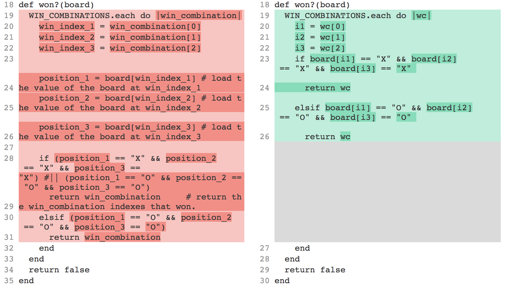
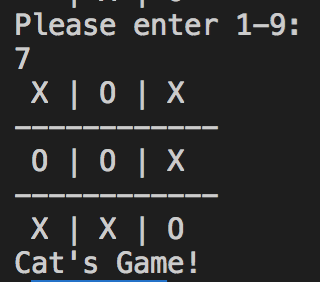
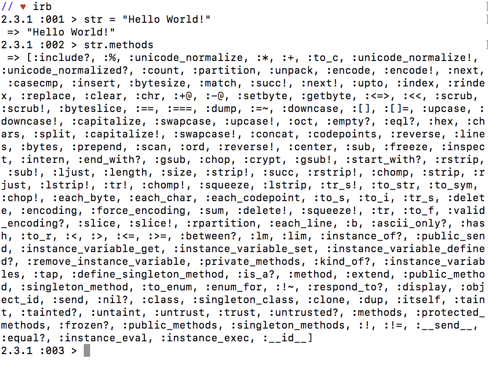
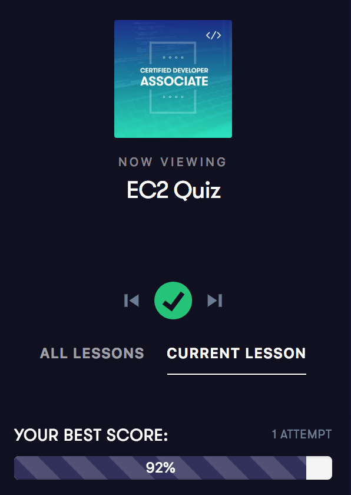

<h1 align="center">100 Days Of Code: Personal Challenge</h1>

Hello World! You are about to witness the beginning of an epic 100-day coding journey where I have challenged myself to code outside of work for 100 consecutive days in the hope to solidify new habits that will allow me to continue to learn new and interesting topics outside of work. 


During this time I plan to go back to my Flatiron School curriculum to review everything from the begining and see what I might have missed the first time around. Additionally I'd like to do my final project as I never finished it since I got a job overseas, and moved to Berlin instead.

Without further ado, I present my **100DaysofCode** personal challenge.

<p align="center">
  
</p>

<p align="center"><b>Follow me on Twitter </b><a href="https://twitter.com/L_corr">here</a>.</p>

<p align="center"><b>Check out my repos </b><a href="https://github.com/lcorr8">here</a>.</p>

<hr>
<br>

<h2 align="center"> Day 1: Tuesday January 8, 2019 </h2>
 
**Today's Progress**: Today I decided to commit to the 100 days of code challenge and I started my visual log inspired by Joe Warren's [How to Transform Your #100DaysOfCode Log Into a Visual Experience](https://medium.freecodecamp.org/how-to-transform-your-100daysofcode-log-into-a-visual-experience-d048334af8d9) article. Additionally I worked on the Intro to Ruby development section of Flatiron School's curriculum through variables(about 16% of the section). Read all of the extra resources, and inspected all of the tests.

**Thoughts** ... wow doing this again I realize I'm taking much more time to read and peruse all resources and book recommendations. I definitely don't think I took enough time to play around before, so i'm enjoying goofing around on the shell and taking this reintroduction less seriously than before. I'm also wondering why on earth I waited so long to dive into the tests the first time around.
<p align="center">
  
</p>

**Link to tweet**
[Day 1](https://twitter.com/L_corr/status/1082777799063158784)

<h2 align="center"> Day 2: Wednesday January 9th into the 10th, 2019 </h2>
 
**Today's Progress**: Today I reviewed Ruby datatypes, array basics, methods and arguments. string interpolation, standard streams (Input/Output).

**Thoughts**: wahh working late into the night is really messing up with my schedule for programming and the log is becoming confusing. Also after a full day of work and evening activities reading/practicing past midnight is not feeling super productive as i'm exhausted. Will attempt to start doing my daily hour in the morning before work next week.

**Link to tweet**
[Day 2](https://twitter.com/L_corr/status/1083488167385358336)

**Link to Articles**
[standard streams wiki](https://en.wikipedia.org/wiki/Standard_streams)

<h2 align="center"> Day 3: Thursday January 10, 2019 </h2>
 
**Today's Progress**: Today I practiced writing Rspec tests, interpolation, default arguments and I refactored some old code in my very first labs.

sample original answer (note the hard coded stuff): 

```Ruby
def display_rainbow(colors)
  puts "R: #{colors[0]}, O: #{colors[1]}, Y: #{colors[2]}, G: #{colors[3]}, B: #{colors[4]}, I: #{colors[5]}, V: #{colors[6]}"
end

# given: ['red', 'orange', 'yellow', 'green', 'blue', 'indigo', 'violet']
# ==> "R: red, O: orange, Y: yellow, G: green, B: blue, I: indigo, V: violet"
```

refactored answer:

```Ruby
#display_rainbow method with an each loop
 
 def display_rainbow(colors)
 	array = []

 	colors.each_with_index do |c, i|
 		array << "#{c[0].upcase}: #{colors[i]}"
 	end

 	puts array.join(", ")
 end

# given: ['red', 'orange', 'yellow', 'green', 'blue', 'indigo', 'violet']
# ==> "R: red, O: orange, Y: yellow, G: green, B: blue, I: indigo, V: violet"
```

**Thoughts** how could I forget how much I love ruby...?!?!?!?!

<p align="center">
  <br>© Disney
</p>

**Tweet**
[Day 3](https://twitter.com/L_corr/status/1083495494960246787)

<h2 align="center"> Days 4-7: January 11-14, 2019 </h2>
 
**Today's Progress**: On Friday and today I switched gears and combined a few days of work in anticipation of some scheduling conflics over the weekend. Additionally I got flexible with the curriculumn and started a course for the AWS Developer certification, on which I will be working on fridays and weekends. This weekend I learned about IAM, EC2, Elastic Load Balancer and Route53. It was super cool to map a domain to the elastic load balancer and then to an EC2 container containing a webserver and seing a 'Hello World!' website.

**Thoughts**: Hoping that my flexible schedule doesn't set me too far back in terms of setting new habits and finishing the Flatiron review I initially set as the goal of this challenge.

**Link to tweet**
[Days 4-7](https://twitter.com/L_corr/status/1084900384492212225)

<h2 align="center"> Day 8: Tuesday January 15, 2019 </h2>
 
**Today's Progress**: Today I read about making CLI applications and I did a review of terminal/bash commands.

**Thoughts**: I know the commands exist but always find myself having to look them up...so i'm adding a [cheat sheet](https://github.com/0nn0/terminal-mac-cheatsheet) in case anybody else wants to review.

**Link to tweet**
[Day 8](https://twitter.com/L_corr/status/1085789710889435136)

**Reference links** 
[29 Linux Commands You Must Know](https://www.hongkiat.com/blog/basic-linux-commands/), [Modify File Permissions with chmod](https://www.linode.com/docs/tools-reference/tools/modify-file-permissions-with-chmod/), [Ownership and Permissions](https://access.redhat.com/documentation/en-US/Red_Hat_Enterprise_Linux/4/html/Step_by_Step_Guide/s1-navigating-ownership.html),
[Permissions
](http://linuxcommand.org/lc3_lts0090.php), [Change permissions for a file in Unix
](https://kb.iu.edu/d/abdb), [How to Set File Permissions Using `chmod'
](https://www.washington.edu/computing/unix/permissions.html).

<h2 align="center"> Day 9: Wednesday January 16, 2019 </h2>
 
**Today's Progress**: Today I worked on the Greeting and move labs for the tic tac toe CLI application. I read about logic and conditionals. and also lost myself for a while reading about CI/CD best practices.

**Thoughts**: I can't seem to get my hour of code on the intended day and find myself doing multiple sessions in a day to catch up... Silver lining: still managing the weekly goals so I guess I will continue to be flexible until I can schedule things better.

<p align="center">
	
</p>

**Link to tweet**
[Day 9](https://twitter.com/L_corr/status/1085994502404427776)

<h2 align="center"> Day 10: Thursday January 17, 2019 </h2>
 
**Today's Progress**: In the past hour I completed the readings and labs for the Rspec fizzbuzz lab, tic tac toe position taken lab and valid tic tac toe move lab.

**Thoughts**: 55% of the intro to Ruby section completed... (61 lessons ya'll!) so basically it now takes me an hour to do what a year ago took me a full- full day... a 12 hour work day #progress also all caught up

<p align="center">
	
</p>

**Link to tweet**
[Day 10](https://twitter.com/L_corr/status/1086011485267070977)

<h2 align="center"> Day 11: Friday January 18, 2019 </h2>
 
**Today's Progress**: AWS friday! Today I learned about EC2 instances with S3 roles, and creating and encrypting EBS volumes. More than I knew last week. :) 

<p align="center">
	
</p>

**Thoughts** ...zZzZ

**Link to tweet**
[Day 11](https://twitter.com/L_corr/status/1086361677841530880)

<h2 align="center"> Day 12: Saturday January 19, 2019 </h2>
 
**Today's Progress**: Tic tac toe CLI game built up until first turn. It was funny to compare my code to the first time I did this exercise almost 2 years ago, although I have not really touched ruby since Flatiron, I can see much less clutter in my code.

```Ruby
# See old me code...

# display_board basic
def display_board(move =" ")
  puts " #{move[0]} | #{move[1]} | #{move[2]} "
  puts "------------"
  puts " #{move[3]} | #{move[4]} | #{move[5]} "
  puts "------------"
  puts " #{move[6]} | #{move[7]} | #{move[8]} "
end
# display_board basic ^

# #position_taken? method here
def position_taken?(board,position)
  move_integer = position.to_i
  move= move_integer - 1
  if board[move] == " "
    false
  elsif board[move] == ""
    false
  elsif board[move] == nil
    false
  else
    true
  end
end
# end of #position_taken? method ^^^

# code your #valid_move? method here
def valid_move?(board,position)
  move_integer = position.to_i
  move= move_integer - 1
  #if position is within board and not taken = valid move
  if move.between?(0,8) && position_taken?(board,position) == false
    true
  # if position is within board and taken = invalid move
  elsif move.between?(0,8) && position_taken?(board,position)
    false
  # if position is outside the board, its an invalid move
  elsif move < 0 || move > 8
    false
  end
end
# end of #valid_move? method ^^^

# code your move method here!
def move(board,position,char= "X")
  move= position.to_i - 1
  board[move] = char
end
# end of #move method ^^^

#define turn(board)
def turn(board)
  #ask for input
  puts "Please enter 1-9:"
  #get input
  position= gets.strip
  #if input is valid
  if valid_move?(board,position)
  #make the move for input
    move(board,position,char= "X")
  #else
  else
  #ask for input again until you get a valid input
  until valid_move?(board,position) == true
    puts "Please select an empty cell in range 1-9"
    position= gets.strip
  #end
  end
  #show the board
  end
display_board(board)
end
```

```Ruby
# See present me code...

def display_board(board)
  puts " #{board[0]} | #{board[1]} | #{board[2]} "
  puts "------------"
  puts " #{board[3]} | #{board[4]} | #{board[5]} "
  puts "------------"
  puts " #{board[6]} | #{board[7]} | #{board[8]} "
end

def input_to_index(input)
  input.to_i - 1
end

def position_taken?(board,index)
  !(board[index] == " " || board[index] == "" || board[index] == nil)
end

def valid_move?(board, index)
  if index.between?(0,8)
      if !position_taken?(board, index)
        true
      else
        false
      end
  end
end

def move(board, index, char="X")
  board[index] = char
end

def turn(board)
  puts "Please enter 1-9:"
  input = gets.strip
  index = input_to_index(input)
  if valid_move?(board, index)
      move(board, index)
      display_board(board)
  else
      turn(board)
  end
end
```

<p align="center">
	
</p>

**Thoughts** ...old me seems to have truly loved comments, I even left instruction comments in place. 

**Link to tweet**
[Day 12](https://twitter.com/L_corr/status/1087415285278224387)

<h2 align="center"> Day 13: Sunday January 20, 2019 </h2>
 
**Today's Progress**: Today I switched gears and instead spent my hour reading `React Handbook` By: Flavio Copes

<p align="center">
	
</p>

**Thoughts**: Flavio offers a bunch of free ebooks, and so far I love the tone in which he writes them, very light and beginner friendly. You can get Flavio's books for free by signing up to his newsletter [here]("https://flaviocopes.com/page/ebooks/").

**Link to tweet**
[Day 13](https://twitter.com/L_corr/status/1087422223474978816)

<h2 align="center"> Day 14: Monday January 21, 2019 </h2>
 
**Today's Progress**: Back to the Flatiron curriculum. Today I worked on loops/iteration concepts, as well as the TTT play loop and the current player method. Finished my monday marathon and I'm all caught up from the weekend again.

<p align="center">
	
</p>

**Link to tweet**
[Day 14](https://twitter.com/L_corr/status/1087458935219589120
)

<h2 align="center"> Day 15: Tuesday January 22, 2019 </h2>
 
**Today's Progress**: Today I went freestyle and wrote a little CLI app to clean an email list that I needed. It takes a horrendously formatted list, pulls emails, and separates into internal/external email lists. yay! Now I can continue planning my women@FS event! here I go! #regex #BetterTogether

**Thoughts**: There is probably a solution for this out there in the web, but it felt so right to build it from scratch...

<p align="center">
	
</p>

**Link to tweet**
[Day 15](https://twitter.com/L_corr/status/1087812925937590272)

<h2 align="center"> Day 16: Wednesday January 23, 2019 </h2>
 
**Today's Progress**: Today I worked on nested array and Ruby enumerables. Particularly Boolean enumerators: #all? (true if every element meets the criteria), #none? (true if none of the elements meet the criteria), #any? (true if any of the elements meets the criteria), #include? (true, if a given object matches the element). And Search enumerables: #select (selects all elements matching criteria, returns an array), #detect or #find ( selects first element matching criteria, returns an object), #reject (selects elements for which the block is false, returns array).

**Thoughts**: sooo many lovely default methods in ruby

<p align="center">
	
</p>

**Link to tweet**
[Day 16](https://twitter.com/L_corr/status/1088182640602243092)

<h2 align="center"> Day 17: Thursday January 24, 2019 </h2>

**Today's Progress**: Today I continued on the TTT project by building out the won?, full?, draw?, over?, and winner methods.

**Thoughts**: my code looked exactly the same except on less lines.

<p align="center">
	
</p>

**Link to tweet**
[Day 17](https://twitter.com/L_corr/status/1089980975579385857)

<h2 align="center"> Day 18: Friday January 25, 2019 </h2>
 
**Today's Progress**: AWS Friday! today I worked on Relational Database Services. I provisioned an RDS instance and connected it to a web server.

**Thoughts**: yay! Fridayyyy! now for an offline weekend!!!
<p align="center">
	
</p>

**Link to tweet**
[Day 18](https://twitter.com/L_corr/status/1089984630084812800)

<h2 align="center"> Day 19: Saturday January 26, 2019 </h2>
 
**Today's Progress**: On Saturday I finished the tic tac toe CLI application. At the moment it only handles a 2 player game.

**Thoughts**: Cats game!

<p align="center">
	
</p>

**Link to tweet**
[Day 19](https://twitter.com/L_corr/status/1090274512459857921)

<h2 align="center"> Day 20: Sunday January 27, 2019 </h2>
 
**Today's Progress**: On sunday I read about Ruby classes, instances, instance methods and instance variables.

**Thoughts**: My all time favorite method is the methods method.

<p align="center">
	
</p>

**Link to tweet**
[Day 20](https://twitter.com/L_corr/status/1090290966165159943)

<h2 align="center"> Day 21: Monday January 28, 2019 </h2>
 
**Today's Progress**: On monday I reviewed 5 lessons on object properties, object lifecycles and object models in Ruby.

**Link to tweet**
[Day 21](https://twitter.com/L_corr/status/1090694902013415424)

<h2 align="center"> Day 22: Tuesday January 29, 2019 </h2>
 
**Today's Progress**: Today I refactored my procedural Tic Tac Toe game into OO Tic Tac Toe, thereby completing the intro to ruby development section of the Flatiron curriculum!

<p align="center">
	
</p>

**Link to tweet**
[Day 22](https://twitter.com/L_corr/status/1091352190621544449)

<h2 align="center"> Day 23: Wednesday January 30, 2019 </h2>
 
**Today's Progress**: Today I completed the Flatiron git and github review section.

**Link to tweet**
[Day 23](https://twitter.com/L_corr/status/1092482697572827136)

<h2 align="center"> Day 24: Thursday January 31, 2019 </h2>
 
**Today's Progress**: Read about the internet, the power of linking resources independently of their hierarchy and Tim Berners-Lee.

<p align="center">
	
</p>

**Resource Links**

[The history of the internet wiki](https://en.m.wikipedia.org/wiki/History_of_the_Internet)

[Internet Service Provider](https://en.m.wikipedia.org/wiki/Internet_service_provider)

**Link to tweet**
[Day 24](https://twitter.com/L_corr/status/1092496310803054592)

<h2 align="center"> Day 25: Friday February 1, 2019 </h2>
 
**Today's Progress**: AWS Friday! Today I finished the EC2 section of a cloud guru aws cert developer - associate course! RDS multi-AZ and read replicas, and elasticache.

**Thoughts**: Only missed 2 questions on the quiz so not a bad starting point. Hoping the exam goes well as well!

<p align="center">
	
</p>

**Link to tweet**
[Day 25](https://twitter.com/L_corr/status/1092500595674677260)

<!-- <h2 align="center"> Day 26: Saturday February 2, 2019 </h2>
 
**Today's Progress**: Today I reviewed basic HTML and CSS. Discovered css garden. my favorites were: [213](http://www.csszengarden.com/213/), [218](http://www.csszengarden.com/218/), [221](http://www.csszengarden.com/221/), and [215](http://www.csszengarden.com/215/).

<p align="center">
	
</p>

**Link to tweet**
[Day 26]() -->

<!-- <h2 align="center"> Day 27: Sunday February 3, 2019 </h2>
 
**Today's Progress**: Regex review! oh my I have avoiding regex for quite a bit.

**Thoughts**: omg [regex golf](https://alf.nu/RegexGolf) hehe literally just overcomplicated things so much...ahh foo

```
foo
```

**Link to tweet**
[Day 27]()

**Link to cool links**
[Rubular](https://rubular.com/)
[regexone](https://regexone.com/)
[regex golf](https://alf.nu/RegexGolf)
[regexr](https://regexr.com/) -->
